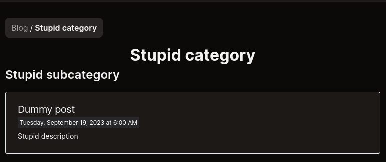
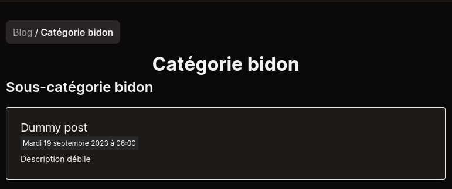

# Add a new blog category

We will create a dummy new blog section.  
This entire process is error-driven [thanks to the _prebuilder_](../prebuilder/01.blog.md).

---

(ViDemo: [🥖 _Ajouter une catégorie de blog et des posts_](https://www.youtube.com/watch?v=NdhN0d-C1Pg))

---

## Our first new blog category

As I write these lines, the [_blog posts folder_](/content/blog/) looks like this:

```
└── patch-notes
    ├── dashboard
    │   ├── en
    │   │   └── post-01.mdx
    │   └── post-01.mdx
    └── discord-bot
        ├── en
        │   └── post-01.mdx
        └── post-01.mdx
```

First, let's create a new directory in the [_blog posts folder_.](/content/blog/)  
We will name it `dummy-category`.

Then, we'll need to add a _subcategory_. To do this, let's create a new directory inside our `dummy-category` folder, named `dummy-subcategory`.

Now, the [_blog posts folder_](/content/blog/) should look like this:

```
├── dummy-category
│   └── dummy-subcategory
└── patch-notes
    ├── dashboard
    │   ├── en
    │   │   └── post-01.mdx
    │   └── post-01.mdx
    └── discord-bot
        ├── en
        │   └── post-01.mdx
        └── post-01.mdx
```

Let's add a _post_ inside `dummy-category/dummy-subcategory`, named `dummy-post`(.mdx).

```markdown
---
title: Dummy post
metadescription: Métadescription débile
description: Description débile
date: 2023-09-19 06:00
---

Hello world!
```

So our example looks like this in our file tree:

```
└── dummy-category
    └── dummy-subcategory
        └── dummy-post.mdx
```

### The [_blog posts folder_](/content/blog/) i18n architecture

#### Brief

Let's assume the _default locale_ is _French_.  
(See also: [_Configure the default language_](../i18n/01.configure-default-language.md))

For instance, in this scenario, `dummy-post`, `dummy-post-02`, and `dummy-post-03` will be mapped to the `/fr/` routes:

```
└── dummy-category
    └── dummy-subcategory
        ├── dummy-post.mdx
        ├── dummy-post-02.mdx
        └── dummy-post-03.mdx
```

In this scenario, if we want to translate them into _English_ and serve them to the `/en/` routes, we will just have to do:

```
└── dummy-category
    └── dummy-subcategory
        ├── en
        │   ├── dummy-post.mdx
        │   ├── dummy-post-02.mdx
        │   └── dummy-post-03.mdx
        ├── dummy-post.mdx
        ├── dummy-post-02.mdx
        └── dummy-post-03.mdx
```

#### Demo

Now, if we go back and try to prove this with our current example: let's add a _post_ inside `dummy-category/dummy-subcategory/en`, named
`dummy-post`.

```markdown
---
title: Dummy post
metadescription: Dummy metadescription
description: Dummy post description for post snippet
date: 2023-09-19 06:00
---

Hello world!
```

So our example looks like this in our file tree:

```
└── dummy-category
    └── dummy-subcategory
        ├── en
        │   └── dummy-post.mdx
        └── dummy-post.mdx
```

### The _DocumentsTypesKey_ tweaker

Let's open the [_contentlayerConfigTweakers.ts_ file.](/interop/config/contentlayer/contentlayerConfigTweakers.ts)  
Then, we will create the `DummyPost` type.

Let's start with some magic, so:

```ts
// contentlayerConfigTweakers.ts
export type BlogDocumentsTypesKeys = 'PatchPost' | 'PatchPostBis';
```

Would become:

```ts
// contentlayerConfigTweakers.ts
export type BlogDocumentsTypesKeys = 'PatchPost' | 'PatchPostBis' | 'DummyPost'; // * ... Added 'DummyPost'
```

Then, we'll append this new _Post type_, in [the _documentTypes config file_.](/interop/config/contentlayer/blog/documentTypes.ts)

Let this:

```ts
// interop/config/blog/documentTypes.ts
const documentsTypesMetadatas: BlogDocumentsTypesMetadatas = {
  PatchPost: {
    name: 'PatchPost',
    categoryFolder: 'patch-notes'
  },
  PatchPostBis: {
    name: 'PatchPostBis',
    categoryFolder: 'patch-notes-bis'
  }
} as const;
```

Becomes:

```ts
// interop/config/blog/documentTypes.ts
const documentsTypesMetadatas: BlogDocumentsTypesMetadatas = {
  PatchPost: {
    name: 'PatchPost',
    categoryFolder: 'patch-notes'
  },
  PatchPostBis: {
    name: 'PatchPostBis',
    categoryFolder: 'patch-notes-bis'
  },
  DummyPost: {
    name: 'DummyPost',
    categoryFolder: 'dummy-category'
  }
} as const;
```

We'll have to trigger again the Contentlayer type definition and data generation.  
To do so, let's run `make build-contentlayer`, and then:

> Contentlayer config change detected. Updating type definitions and data...  
> Generated \_ documents in .contentlayer

_(No Contentlayer error, cool!)_

### i18n handling of categories and subcategories

If we try to build now, we'll get an error about the i18n.  
This is because we need to adapt our locale files.

To do this, let's turn this:

```ts
// src/i18n/locales/fr.ts

// * ...
'blog-categories': {
  'patch-notes': {
    '_meta-description': 'Metadescription Notes de patch',
    _title: 'Patch notes',
    'discord-bot': {
      'meta-description': 'Metadescription Patch-notes -> Bot Discord',
      title: 'Discord Bot'
    },
    dashboard: {
      'meta-description': 'Metadescription Patch-notes -> Dashboard',
      title: 'Dashboard'
    },
  }
  // * ...
}
```

To this:

```ts
// src/i18n/locales/fr.ts

// * ...

'pages-titles': {
  // * ...
  'dummy-category': 'Catégorie bidon',
  'dummy-subcategory': 'Sous-catégorie bidon'
  // * ... Added dummy-category related path segments
}
// * ...
'blog-categories': {
  'dummy-category': {
    'dummy-subcategory': {
      'meta-description': 'Metadescription bidon -> sous-catégorie bidon',
      title: 'Sous-catégorie bidon'
    },
    '_meta-description': 'Metadescription bidon',
    _title: 'Catégorie bidon'
  },
  // * ... Added dummy-category i18n informations

  'patch-notes': {
    '_meta-description': 'Metadescription Notes de patch',
    _title: 'Patch notes',
    'discord-bot': {
      'meta-description': 'Metadescription Patch-notes -> Bot Discord',
      title: 'Discord Bot'
    },
    dashboard: {
      'meta-description': 'Metadescription Patch-notes -> Dashboard',
      title: 'Dashboard'
    },
  }
  // * ...
}
```

Adapt all your locales, and then follow the next step.

### The [blog.ts config file](/src/config/blog.ts)

**If you use automated imports (i.e.: `Object.fromEntries` in the [blog.ts config file](/src/config/blog.ts)), you're already done!**  
Otherwise, we'll also need to adapt the value of `BLOG_CATEGORIES_ALL_POSTS_CONSTS_ASSOC`.

Let's change this:

```ts
// config/blog.ts
BLOG_CATEGORIES_ALL_POSTS_CONSTS_ASSOC: {
  'patch-notes': () => import('contentlayer/generated').then((module) => module.allPatchPosts)
}
```

To this:

```ts
// config/blog.ts
BLOG_CATEGORIES_ALL_POSTS_CONSTS_ASSOC: {
  'patch-notes': () => import('contentlayer/generated').then((module) => module.allPatchPosts),
  'dummy-category': () => import('contentlayer/generated').then((module) => module.allDummyPosts) // * ... Added our new category and all its related posts
}
```

Let's build again!  
Then, go to `/blog/dummy-category`.

---

<p align="center"></p>
<p align="center"></p>

Congrats!  
You made it!
