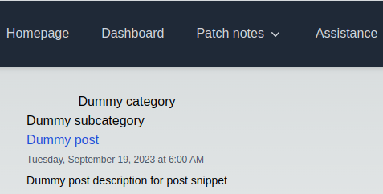
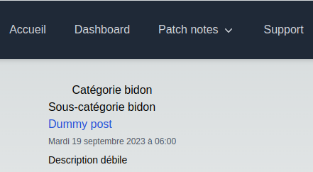

# Add a new blog category

We will create a dummy new blog section.  
This entire process is errors-driven [thanks to the internal _static analyzer_.](./01.static-analyzer.md)

---

## Our first new blog category

As I write these lines, the [_posts folder_](/posts/) looks like this:

```
└── patch-notes
    ├── dashboard
    │   ├── en
    │   │   └── post-01.md
    │   └── post-01.md
    └── discord-bot
        ├── en
        │   └── post-01.md
        └── post-01.md
```

First, let's create a new directory in the [_posts folder_.](/posts/)  
We will name it `dummy-category`.

Then, we'll need to add a _subcategory_. To do this, let's create a new directory inside our `dummy-category` folder, named `dummy-subcategory`.

Now, the [_posts folder_](/posts/) should look like this:

```
├── dummy-category
│   └── dummy-subcategory
└── patch-notes
    ├── dashboard
    │   ├── en
    │   │   └── post-01.md
    │   └── post-01.md
    └── discord-bot
        ├── en
        │   └── post-01.md
        └── post-01.md
```

Let's add a _post_ inside `dummy-category/dummy-subcategory`, named `dummy-post.md`.

```markdown
---
title: Dummy post
metadescription: Métadescription débile
description: Description débile
date: 2023-09-19 06:00
---

Hello world!
```

So our example looks like this in our filetree:

```
├── dummy-category
│   └── dummy-subcategory
│       └── dummy-post.md
```

### The [_posts folder_](/posts/) i18n architecture

Let's assume the _default locale_ is _French_.

In this scenario, `dummy-post.md`, `dummy-post-02.md` and `dummy-post-03.md` will be mapped to the `/fr/` routes.

```
├── dummy-category
│   └── dummy-subcategory
│       ├── dummy-post.md
│       ├── dummy-post-02.md
│       └── dummy-post-03.md
```

If we want to translate them into _English_ and serve them to the `/en/` routes, we will just have to do:

```
├── dummy-category
│   └── dummy-subcategory
│       ├── en
│       │   ├── dummy-post.md
│       │   ├── dummy-post-02.md
│       │   └── dummy-post-03.md
│       ├── dummy-post.md
│       ├── dummy-post-02.md
│       └── dummy-post-03.md
```

To prove this with the current example: let's add a _post_ inside `dummy-category/dummy-subcategory/en`, named `dummy-post.md`.

```markdown
---
title: Dummy post
metadescription: Dummy metadescription
description: Dummy post description for post snippet
date: 2023-09-19 06:00
---

Hello world!
```

So our example looks like this in our filetree:

```
├── dummy-category
│   └── dummy-subcategory
│       ├── en
│       │   └── dummy-post.md
│       └── dummy-post.md
```

### The [contentlayer.config.ts file](/contentlayer.config.ts)

Let's open the [contentlayer.config.ts file.](/contentlayer.config.ts)  
Then, we will create the `DummyPost` type.

Basically, we just need to copy/paste `PhantomPost` (or any another _Post_ type, based on `PhantomPost`) and slightly adapt it:

```ts
// contentlayer.config.ts
const DummyPost = defineDocumentType(() => ({
  name: 'DummyPost', // * ... Adapt the type name
  filePathPattern: '**/dummy-category/**/*.md', // * ... Adapt the file path pattern
  fields: {
    title: { type: 'string', required: true },
    metadescription: { type: 'string', required: true },
    description: { type: 'string', required: false },
    date: { type: 'date', required: true }
  },
  // * ... Adapt the url field to make it a computed field
  computedFields: {
    url: { type: 'string', resolve: (post) => `/${post._raw.flattenedPath}` }
  }
}));
```

Then, we'll append this new _Post type_.  
Let this:

```ts
// contentlayer.config.ts
export default makeSource({ contentDirPath, documentTypes: [PhantomPost, PatchPost] });
```

Becomes:

```ts
// contentlayer.config.ts
export default makeSource({ contentDirPath, documentTypes: [PhantomPost, PatchPost, DummyPost] });
```

And let's build!

> `$ next build`  
> Generated \_ documents in .contentlayer

We don't get any _Content Layer_ generation warning, perfect!

### The [blog.ts config file](/src/config/blog.ts)

Now we have to edit the [blog.ts config file.](/src/config/blog.ts)  
Firstly, let's adapt the `BlogArchitecture` type.

This:

```ts
// config/blog.ts
export type BlogArchitecture = {
  'patch-notes': 'dashboard' | 'discord-bot';
};
```

Becomes:

```ts
// config/blog.ts
export type BlogArchitecture = {
  'patch-notes': 'dashboard' | 'discord-bot';
  'dummy-category': 'dummy-subcategory';
};
```

We'll also need to adjust the value of `BLOG_CATEGORIES_ALL_POSTS_CONSTS_ASSOC`.

Let's change this:

```ts
// config/blog.ts
BLOG_CATEGORIES_ALL_POSTS_CONSTS_ASSOC: {
  'patch-notes': () => allPatchPosts
}
```

To this:

```ts
// config/blog.ts
BLOG_CATEGORIES_ALL_POSTS_CONSTS_ASSOC: {
  'patch-notes': () => allPatchPosts,
  'dummy-category': () => allDummyPosts // * ... Added our new category and all its related posts
}
```

Let's try to build again.  
We'll have an error.

> Failed to pass the static analysis! (./src/i18n/locales/fr.ts)  
> Categories keys must be exhaustive!  
> Missing key: dummy-category

This is because we need to add some informations in our _locales_ files.

### The blog categories i18n

Let's start by editing our _default language_ file. In the current case, it is [fr.ts](/src/i18n/locales/fr.ts), but it would depend about
[your i18n config on your side](/src/config/i18n.ts): the _default language_ will be the _locale_ targeted by _VocabBase_, that must also match the
`ELanguagesFlag` enum first key.

So:

```ts
// locales/fr.ts
export default {
  // * ...
  'blog-categories': {
    'patch-notes': {
      _title: 'Patch Notes',
      'discord-bot': 'Bot Discord',
      dashboard: 'Dashboard'
    }
  }
  // * ...
} as const;
```

Would become:

```ts
// locales/fr.ts
export default {
  // * ...
  'blog-categories': {
    'patch-notes': {
      _title: 'Patch Notes',
      'discord-bot': 'Bot Discord',
      dashboard: 'Dashboard'
    },
    'dummy-category': {
      _title: 'Catégorie bidon',
      'dummy-subcategory': 'Sous-catégorie bidon'
    }
  }
  // * ...
} as const;
```

**Do not forget to also update your _locales_ in all the other languages of your project! (_Anyway, it's errors-driven..._)**

Let's build again!  
Then, go to `/dummy-category`.

<p align="center"></p>
<p align="center"></p>

Congrats!  
You made it!
