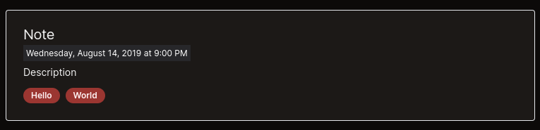
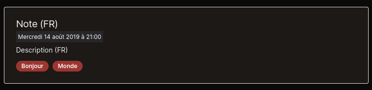

# Blog tags

Let's explore the tags feature!

---

## The blog documents front-matter

Let's create a dummy blog document.

```markdown
---
title: Note
metadescription: Meta description
description: Description
date: 2019-08-14 21:00
---

Hello world!
```

By default, this document will not have any tag.

You can tweak it to enable the tags feature just like so:

```markdown
---
tags: ['hello', 'world']
title: Note
metadescription: Meta description
description: Description
date: 2019-08-14 21:00
---

Hello world!
```

You can also write it as follows:

```markdown
---
tags:
  - hello
  - world
title: Note
metadescription: Meta description
description: Description
date: 2019-08-14 21:00
---

Hello world!
```

Because of a weird Contentlayer bug, keep the `tags` field at the top of the document properties. Otherwise, it could break its parsing on Windows.

**Don't forget to describe the tags for your blog post in all its different languages.**

## The Blog Tags Config file

It is possible to manage the blog tags thanks to the [_blog tags config file_.](/interop/config/contentlayer/blog/blogTags.ts)

Let:

```ts
// interop/config/contentlayer/blog/blogTags.ts
const _blogTagOptions = [] as const satisfies string[];
```

Become:

```ts
// interop/config/contentlayer/blog/blogTags.ts
const _blogTagOptions = ['hello', 'world'] as const satisfies string[]; // * ... Added 'hello' and 'world' tags
```

Then, you'll notice a new error in your [locale files.](/src/i18n/locales)

For instance:

> Type '{}' is missing the following properties from type 'MakeHomogeneousValuesObjType<Record<"hello" | "world">, string>': hello, world

This is because your [i18n schema file](/src/i18n/locales/schema.ts) injects i18n constraints to force you to declare the translations of your blog
tags:

```ts
// src/i18n/locales/schema.ts
'blog-tags': blogTagOptionsVocabSchema
```

Let's fix it!

Turn this:

```ts
// src/i18n/locales/fr.ts
'blog-tags': {}
```

Into this:

```ts
// src/i18n/locales/fr.ts
'blog-tags': {
  hello: 'Bonjour',
  world: 'Monde'
}
```

Adapt all your locales like this, then, go to your blog category page.

---

<p align="center"></p>
<p align="center"></p>

Congrats!  
You made it!
