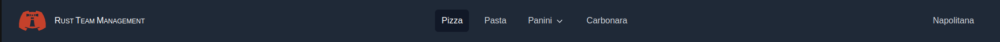

# Add a new language

I wanted the i18n to remain as _typesafe_ as possible while also being as easy to maintain as possible.  
Here, we will add a very personal _Italian_ translation in our project.

## Pizzas language to the rescue

Let's open [the _locales_ folder](/src/i18n/locales) and then create a `it.ts` file, as follow:

```ts
// locales/it.ts
import { VocabType } from '@/types/i18n';

export default {
  whatever: {
    key1: 'Pizza',
    key2: 'Pasta'
    // * ...
  }
  // * ...
} as const satisfies VocabType;
```

## The `ELanguagesFlag` enum

We have to add `it` key in [the _`ELanguagesFlag` enum_.](/interop/config/i18n.ts)

Then:

```ts
// config/i18n.ts
export enum ELanguagesFlag {
  fr,
  en
}
```

Would become:

```ts
// config/i18n.ts
export enum ELanguagesFlag {
  fr,
  en,
  it // * ... hello there!
}
```

## The _localesLabels_ file

Now, you'll have to adapt [_the localesLabels file_](/src/i18n/localesLabels.ts)

So that:

```ts
export const localesLabels: LanguageLabels = {
  en: 'English',
  fr: 'Français'
} as const;

export const localesEmojis: LanguageLabels = {
  en: '🇬🇧',
  fr: '🇫🇷'
} as const;
```

Would become:

```ts
export const localesLabels: LanguageLabels = {
  en: 'English',
  fr: 'Français',
  it: 'Italiano'
} as const;

export const localesEmojis: LanguageLabels = {
  en: '🇬🇧',
  fr: '🇫🇷',
  it: '🇮🇹'
} as const;
```

**If you use automated imports (i.e: `Object.fromEntries` in [getLocales.ts](/src/i18n/getLocales.ts)), you're already done!**  
(Otherwise, see also: [_Hard-coding concerns (no automated import)_](./01.static-analyzer.md#hard-coding-concerns-no-automated-import))

Now, let's build again, and then go to `/it`.

---

<p align="center"></p>

Congrats!  
You made it!

#### Appendix: add the new posts files

Don't forget to adapt the structure of your [_posts_ folder.](/posts/)  
For instance, here, you should add 'it' folders, and create your italian blog files accordingly.  
(Read also: [The _posts folder_ i18n architecture](/doc/blog/02.add-new-blog-category.md#the-posts-folder-i18n-architecture))
