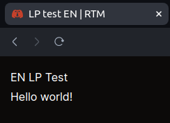
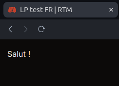

# Add a new landing page category

We will create a dummy new landing page category.  
This entire process is error-driven [thanks to the _prebuilder_](../prebuilder/04.landing-pages.md).

---

## Our first new landing page category

As I write these lines, the [_landing pages folder_](/content/landing-pages/) looks like this:

```
└── landing-pages-testing-category
    ├── en
    │   ├── fake-draft-lp-00.mdx
    │   ├── fake-lp-00.mdx
    │   └── index.mdx
    ├── fake-draft-lp-00.mdx
    ├── fake-lp-00.mdx
    └── index.mdx
```

First, let's create a new directory in the [_landing pages folder_.](/content/landing-pages/)  
We will name it `dummy-category`.

Now, the [_landing pages folder_](/content/landing-pages/) should look like this:

```
├── dummy-category
└── landing-pages-testing-category
    ├── en
    │   ├── fake-draft-lp-00.mdx
    │   ├── fake-lp-00.mdx
    │   └── index.mdx
    ├── fake-draft-lp-00.mdx
    ├── fake-lp-00.mdx
    └── index.mdx
```

Let's add a _landing page_ inside `dummy-category`, named `lp-00`(.mdx).

```markdown
---
title: LP test FR
metadescription: Meta description LP test FR
---

Salut !
```

So our example looks like this in our file tree:

```
└── dummy-category
    └── lp-00.mdx
```

### The [_landing pages folder_](/content/landing-pages/) i18n architecture

#### Brief

Let's assume the _default locale_ is _French_.  
(See also: [_Configure the default language_](../i18n/01.configure-default-language.md))

For instance, in this scenario, `lp-00`, `lp-01`, and `lp-02` will be mapped to the `/fr/` routes:

```
└── dummy-category
    └── dummy-subcategory
        ├── lp-00.mdx
        ├── lp-01.mdx
        └── lp-02.mdx
```

In this scenario, if we want to translate them into _English_ and serve them to the `/en/` routes, we will just have to do:

```
└── dummy-category
    └── dummy-subcategory
        ├── en
        │   ├── lp-00.mdx
        │   ├── lp-01.mdx
        │   └── lp-02.mdx
        ├── lp-00.mdx
        ├── lp-01.mdx
        └── lp-02.mdx
```

#### Demo

Now, if we go back and try to prove this with our current example: let's add a _post_ inside `dummy-category/en`, named `lp-00`.

```markdown
---
title: LP test EN
metadescription: Meta description LP test EN
---

EN LP Test  
Hello world!
```

So our example looks like this in our file tree:

```
└── dummy-category
    ├── en
    │   └── lp-00.mdx
    └── lp-00.mdx
```

Let's build again!  
Then, go to `/lp/dummy-category-lp-00`.

---

<p align="center"></p>
<p align="center"></p>

Congrats!  
You made it!
