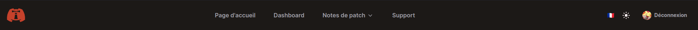
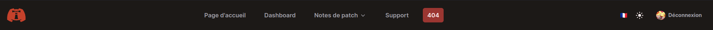

# Add a new element to the Navbar

The code aims to be as dynamic as possible. For this reason, the navbar is also configurable in a fairly straightforward manner.  
We will create a new element in the navbar quite easily here.  
This entire process is errors-driven thanks to some typing magic.

---

As I write these lines, the navbar looks like this:

<p align="center"></p>

We will add a simple button that will redirect to the `/404` route.

## Our first new navbar button

### The [`SitewideNavbarRoutesKeys` type](/src/config/SitewideNavbar/utils/RoutesMapping.ts)

[We will first edit the `SitewideNavbarRoutesKeys` type, in the `routesMapping.ts` file of the SitewideNavbar's config folder.](/src/config/SitewideNavbar/utils/RoutesMapping.ts)

For instance, if I have:

```ts
// SitewideNavbar/utils/RoutesMapping.ts
export type SitewideNavbarRoutesKeys = 'HOME_PAGE' | 'DASHBOARD_PAGE' | 'PATCH_NOTES_PAGE' | 'SUPPORT_PAGE';
```

I will just add a new key:

```ts
// SitewideNavbar/utils/RoutesMapping.ts
export type SitewideNavbarRoutesKeys = 'HOME_PAGE' | 'DASHBOARD_PAGE' | 'PATCH_NOTES_PAGE' | 'SUPPORT_PAGE' | 'NOTFOUND_PAGE'; // ... Added "NOTFOUND_PAGE" key
```

We'll have an error.

> ./src/config/SitewideNavbar/routesImpl.ts:8:14  
> **Type error**: Property 'NOTFOUND_PAGE' is missing in type '...' but required in type 'SitewideNavbarRoutes'.

This is because we need to update [the `routesImpl.ts` file of the SitewideNavbar's config folder.](/src/config/SitewideNavbar/routesImpl.ts)

### The navbar routes implementation

Let's open this [routesImpl.ts file](/src/config/SitewideNavbar/routesImpl.ts), then:

```ts
// SitewideNavbar/routesImpl.ts
export const SITEWIDE_NAVBAR_ROUTES: SitewideNavbarRoutes = {
  HOME_PAGE: BASE,
  DASHBOARD_PAGE: ROUTES_ROOTS.DASHBOARD,
  PATCH_NOTES_PAGE: ROUTES_ROOTS.PATCH_NOTES,
  SUPPORT_PAGE: DISCORD_CONFIG.SUPPORT_SERVER_INVITE_LINK
} as const;

const { navbar, pagesTitles } = i18ns;
export const SITEWIDE_NAVBAR_ROUTES_TITLES: SitewideNavbarRoutesTitles = {
  HOME_PAGE: `${pagesTitles}.homepage`,
  DASHBOARD_PAGE: `${pagesTitles}.dashboard`,
  PATCH_NOTES_PAGE: `${pagesTitles}.patch-notes`,
  SUPPORT_PAGE: `${navbar}.assistance`
} as const;
```

Would become:

```ts
// SitewideNavbar/routesImpl.ts
export const SITEWIDE_NAVBAR_ROUTES: SitewideNavbarRoutes = {
  HOME_PAGE: BASE,
  DASHBOARD_PAGE: ROUTES_ROOTS.DASHBOARD,
  PATCH_NOTES_PAGE: ROUTES_ROOTS.PATCH_NOTES,
  SUPPORT_PAGE: DISCORD_CONFIG.SUPPORT_SERVER_INVITE_LINK,
  NOTFOUND_PAGE: BASE + '404' // ... Added "NOTFOUND_PAGE" key & value
} as const;

const { navbar, pagesTitles } = i18ns;
export const SITEWIDE_NAVBAR_ROUTES_TITLES: SitewideNavbarRoutesTitles = {
  HOME_PAGE: `${pagesTitles}.homepage`,
  DASHBOARD_PAGE: `${pagesTitles}.dashboard`,
  PATCH_NOTES_PAGE: `${pagesTitles}.patch-notes`,
  SUPPORT_PAGE: `${navbar}.assistance`,
  NOTFOUND_PAGE: `${navbar}.not-found` // ... Added "NOTFOUND_PAGE" key & value
} as const;
```

Then, we will have a new error:

> ./src/config/SitewideNavbar/routesImpl.ts:23:3  
> **Type error**: Type '"navbar.not-found"' is not assignable to type '...'.

This is because we need to update [the _locales_ files of the i18n.](/src/i18n/locales/)

### The navbar i18n

Let:

```ts
// locales/fr.ts
export default {
  // * ...
  navbar: {
    assistance: 'Support'
  }
  // * ...
} as const satisfies VocabType;
```

Become:

```ts
// locales/fr.ts
export default {
  // * ...
  navbar: {
    assistance: 'Support',
    'not-found': '404' // * ... Added a dummy 'not-found' label translation for the fr.ts file
  }
  // * ...
} as const satisfies VocabType;
```

And then, adapt the [_schema_](/src/i18n/locales/schema.ts) and the other _translations files_.

Let's build again.

<p align="center"></p>
<p align="center"></p>

Congrats!  
You made it!
