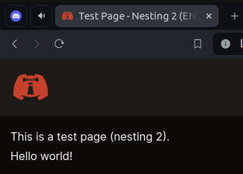
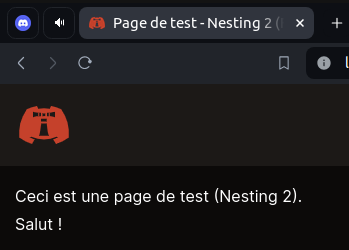

# Add a new page nesting

We will create a dummy new page nesting.  
This entire process is error-driven [thanks to the _prebuilder_](../prebuilder/03.pages.md).

---

## Our first new page nesting

As I write these lines, the [_pages folder_](/content/pages/) looks like this:

```
├── en
│   ├── nesting-1
│   │   └── page-00.mdx
│   └── page-00.mdx
├── nesting-1
│   ├── page-00.mdx
│   └── page-01.mdx
├── page-00.mdx
├── page-01.mdx
└── testing-pages-root
    ├── fake-draft-00.mdx
    ├── fake-nesting
    │   └── index.mdx
    └── fake-page-00.mdx
```

First, let's create a new directory in the [_pages folder_.](/content/pages/)  
We will name it `nesting-2`.

Now, the [_pages folder_](/content/pages/) should look like this:

```
├── en
│   ├── nesting-1
│   │   ├── nesting-2
│   │   └── page-00.mdx
│   └── page-00.mdx
├── nesting-1
│   ├── nesting-2
│   ├── page-00.mdx
│   └── page-01.mdx
└── ...
```

Let's add a _page_ inside `nesting-2`, named `page-00`(.mdx).

```markdown
---
title: Page de test - Nesting 2 (FR)
metadescription: Metadescription de la page de test - Nesting 2 (FR)
---

Ceci est une page de test (Nesting 2).  
Salut !
```

So our example looks like this in our file tree:

```
└── nesting-1
    └── nesting-2
        └── page-00.mdx
```

### The [_pages folder_](/content/pages/) i18n architecture

#### Brief

Let's assume the _default locale_ is _French_.  
(See also: [_Configure the default language_](../i18n/01.configure-default-language.md))

For instance, in this scenario, `nesting-1/nesting-2/page-00`, `nesting-1/nesting-2/page-01`, and `nesting-1/nesting-2/page-02` will be mapped to the
`/fr/` routes:

```
└── nesting-1
    └── nesting-2
        ├── page-00.mdx
        ├── page-01.mdx
        └── page-02.mdx
```

In this scenario, if we want to translate them into _English_ and serve them to the `/en/` routes, we will just have to add a _root_ folder `en`,
likewise:

```
├── en
│   └── nesting-1
│       └── nesting-2
│           ├── page-00.mdx
│           ├── page-01.mdx
│           └── page-02.mdx
└── nesting-1
    └── nesting-2
        ├── page-00.mdx
        ├── page-01.mdx
        └── page-02.mdx
```

#### Demo

Now, if we go back and try to prove this with our current example: let's add a _post_ inside `en/nesting-1/nesting-2`, named `page-00`.

```markdown
---
title: Test Page - Nesting 2 (EN)
metadescription: Test page metadescription
---

This is a test page (nesting 2).  
Hello world!
```

So our example looks like this in our file tree:

```
├── en
│   └── nesting-1
│       └── nesting-2
│           └── page-00.mdx
└── nesting-1
    └── nesting-2
        └── page-00.mdx
```

Let's build again!  
Then, go to `/nesting-1/nesting-2/page-00`.

---

<p align="center"></p>
<p align="center"></p>

Congrats!  
You made it!
