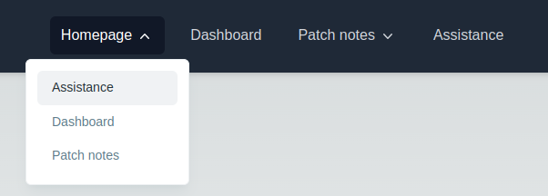
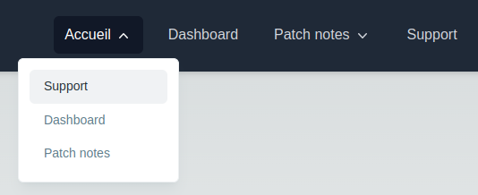

# Configure navbar dropdowns

The edition of dropdowns aims to be as simple and '_Plug and play_' as possible in this codebase.  
As I write these lines, the navbar looks like this:

<p align="center"></p>

We are going to edit the 'Accueil' (_Homepage_) element to turn it into a dropdown with three entries:

- Assistance,
- Dashboard,
- Patch Notes

## Setting a dropdown config for the `HOME_PAGE` element

We will just edit the `SITEWIDE_NAVBAR_DROPDOWNS_CONFIG` constant in the [`dropdownsConfig.ts`](/src/config/SitewideNavbar/dropdownsConfig.ts) file,
which is based on the [`SitewideNavbarRoutesKeys` type](/src/config/SitewideNavbar/utils/RoutesMapping.ts).

I'll just add a new element for the `HOME_PAGE` key.  
Let's create it:

```ts
// SitewideNavbar/dropdownsConfig.ts
const HOME_PAGE: EmbeddedEntities = [
  { path: SITEWIDE_NAVBAR_ROUTES.SUPPORT_PAGE, i18nTitle: SITEWIDE_NAVBAR_ROUTES_TITLES.SUPPORT_PAGE },
  { path: SITEWIDE_NAVBAR_ROUTES.DASHBOARD_PAGE, i18nTitle: SITEWIDE_NAVBAR_ROUTES_TITLES.DASHBOARD_PAGE },
  { path: SITEWIDE_NAVBAR_ROUTES.PATCH_NOTES_PAGE, i18nTitle: SITEWIDE_NAVBAR_ROUTES_TITLES.PATCH_NOTES_PAGE }
];
```

Now, let's append this!  
For example:

```ts
// SitewideNavbar/dropdownsConfig.ts
export const SITEWIDE_NAVBAR_DROPDOWNS_CONFIG: NavbarDropdownsConfig = { PATCH_NOTES_PAGE } as const;
```

Would become:

```ts
// SitewideNavbar/dropdownsConfig.ts
export const SITEWIDE_NAVBAR_DROPDOWNS_CONFIG: NavbarDropdownsConfig = { PATCH_NOTES_PAGE, HOME_PAGE } as const;
```

---

<p align="center"></p>
<p align="center"></p>

Congrats!  
You made it!
